# DSMS (数据结构管理系统)

## 项目结构

- `dsms-web/`: 前端项目 (Vue.js)
- `dsms-backend/`: 后端项目 (Spring Boot)

## 数据库设计规范

### 表命名规范

1. 所有表名必须以 `t_` 前缀开头
2. 表名使用小写字母
3. 多个单词之间使用下划线 `_` 分隔
4. 表名应该使用英文单词，并且能够清晰表达表的用途

### 字段命名规范

1. 字段名使用小写字母
2. 多个单词之间使用下划线 `_` 分隔
4. 创建时间字段统一命名为 `created_at`
5. 更新时间字段统一命名为 `updated_at`
6. 最后修改人字段统一命名为 `last_modified_by`
7. 布尔类型字段使用 `is_` 前缀，如 `is_active`

### 索引命名规范

1. 主键索引：`pk_表名`
2. 唯一索引：`uk_表名_字段名`
3. 普通索引：`idx_表名_字段名`

## 系统设计

### 登录功能流程图

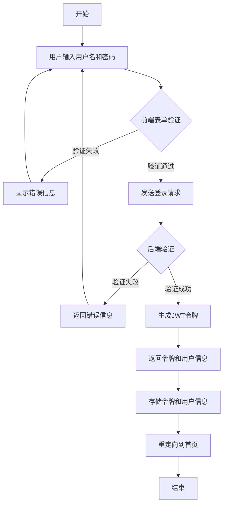

### 用户认证ER图

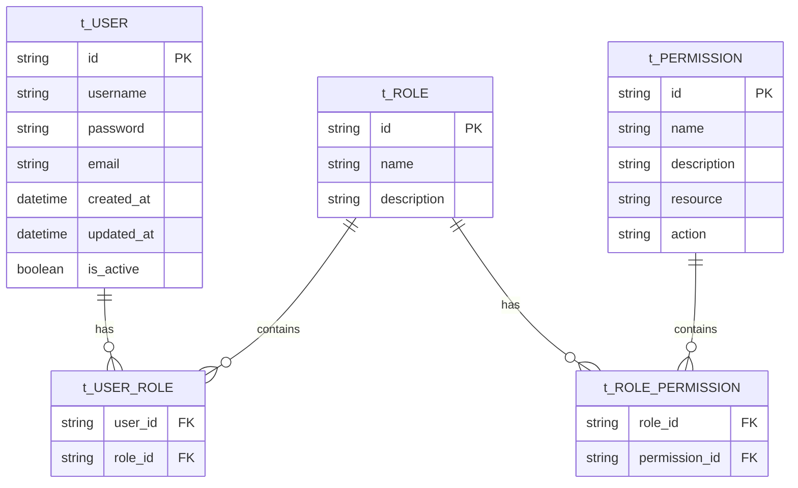
### 产品管理功能流程图

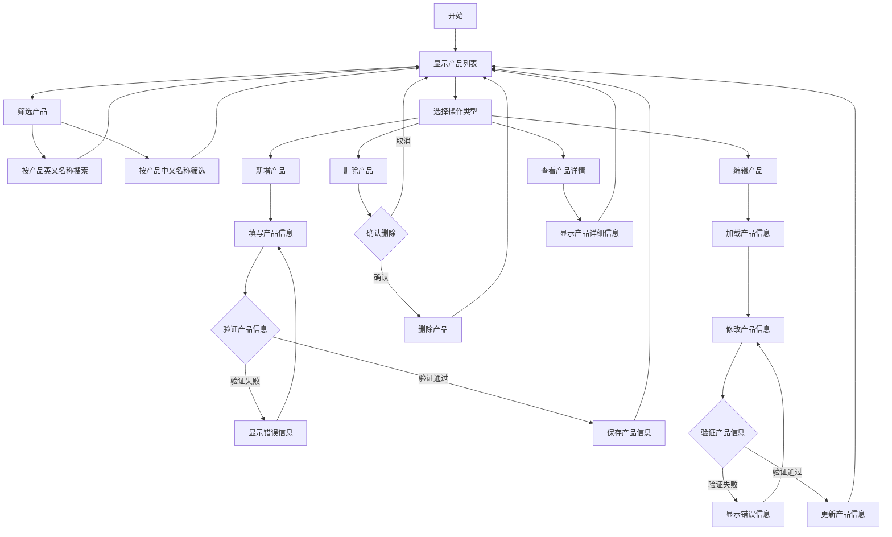
### 产品管理ER图

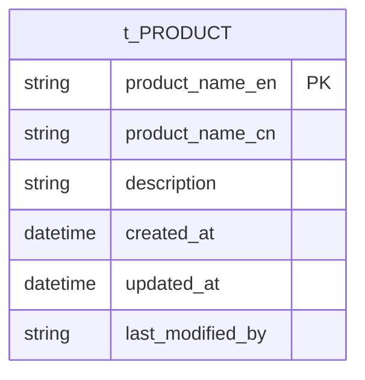

### 批次管理功能流程图

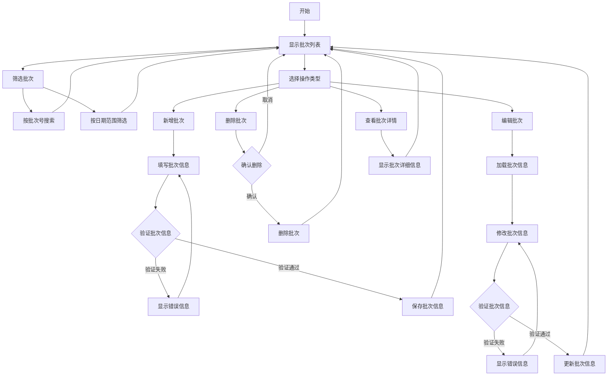

### 批次管理ER图

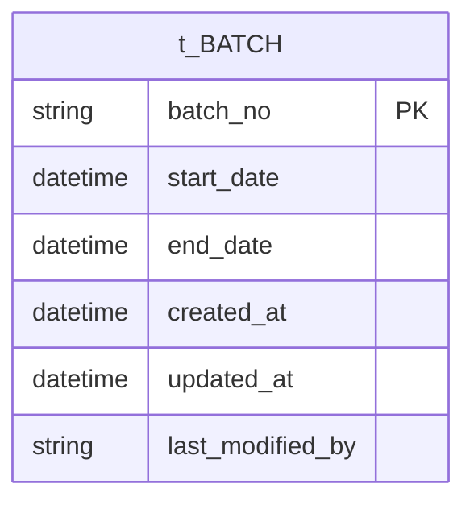

### 产品批次关联管理功能流程图

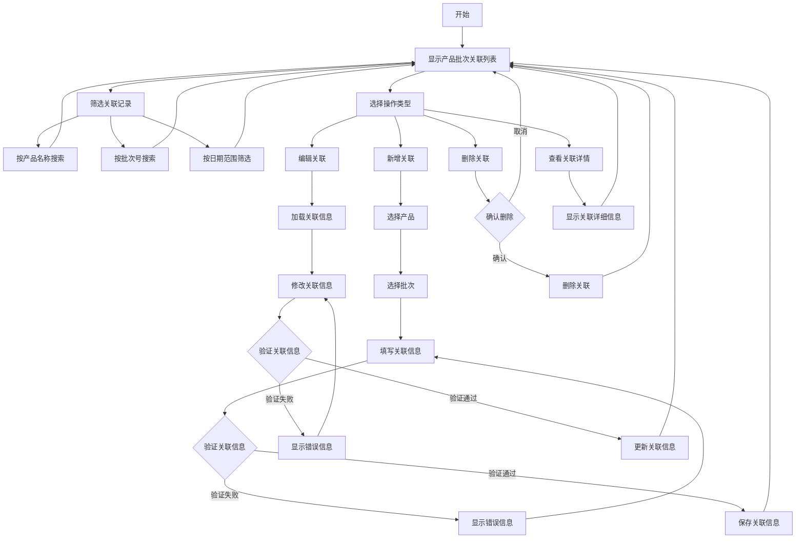

### 产品批次关联管理ER图

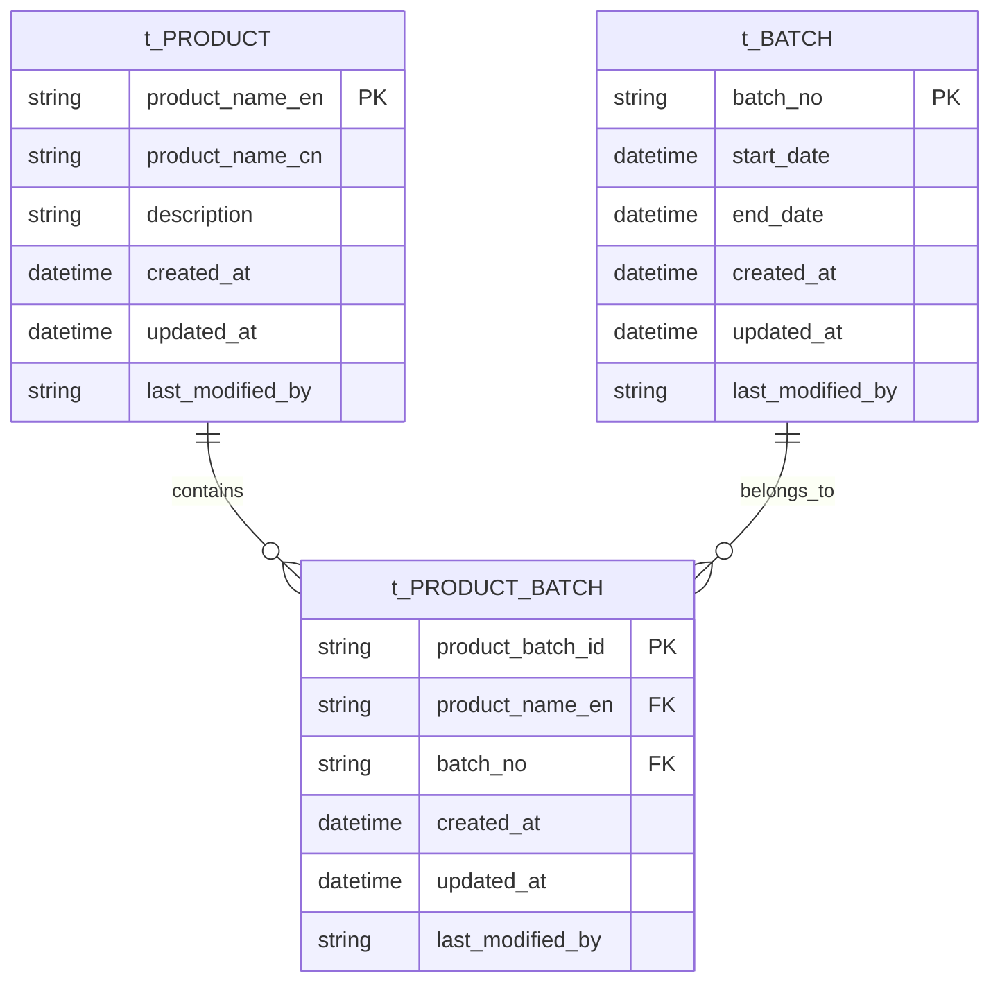

### 数据库参数管理功能流程图

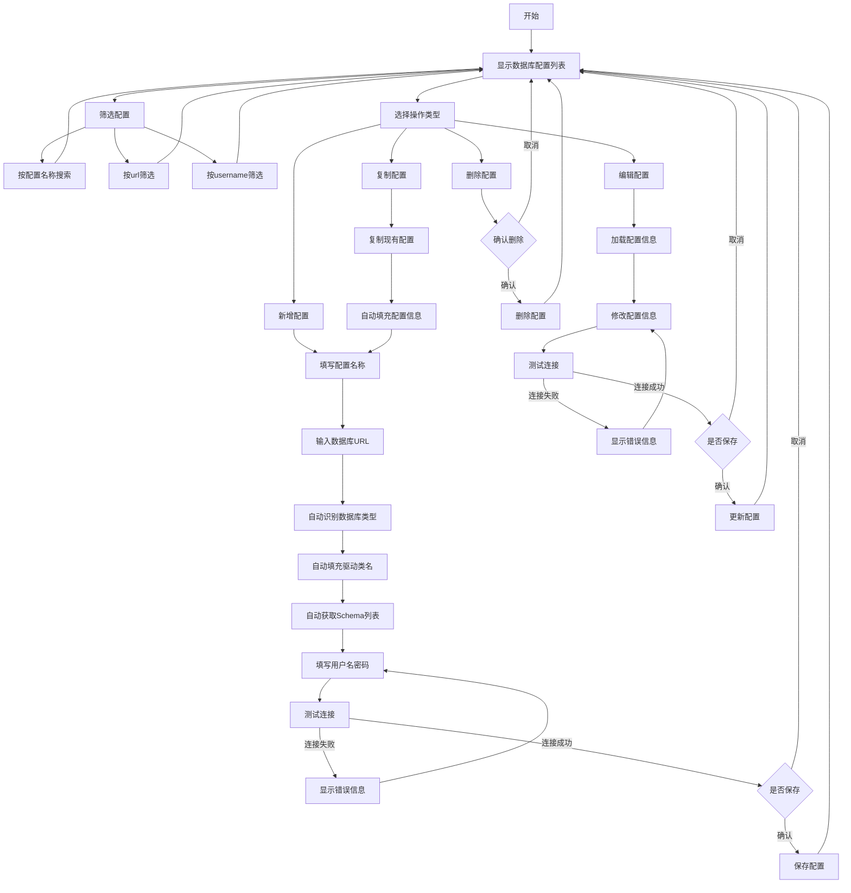

### 数据库参数管理ER图

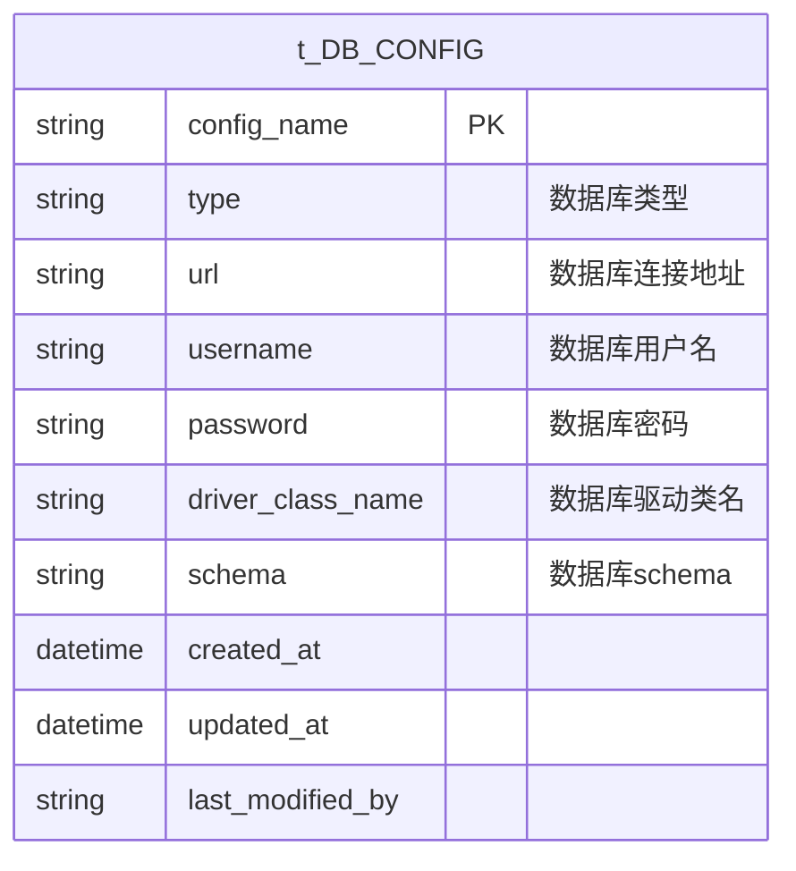

### 产品批次配置管理功能流程图

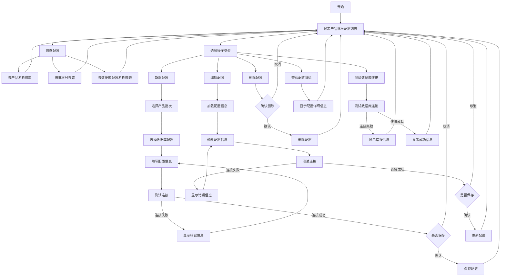

### 产品批次配置管理ER图

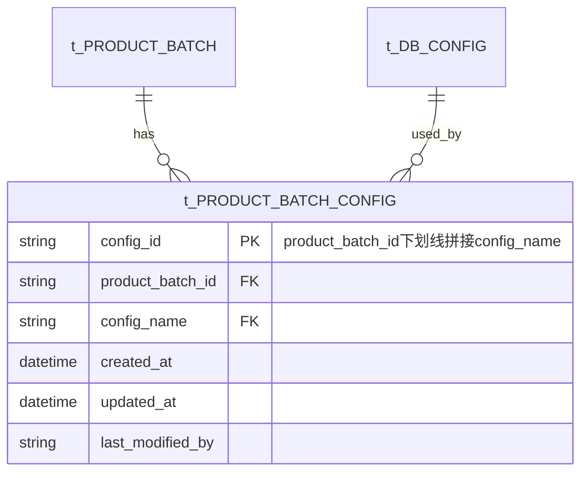

## 开发环境要求

### 前端
- yarn
- nuxt

### 后端
- Java JDK 17+
- Maven
- Spring Boot
