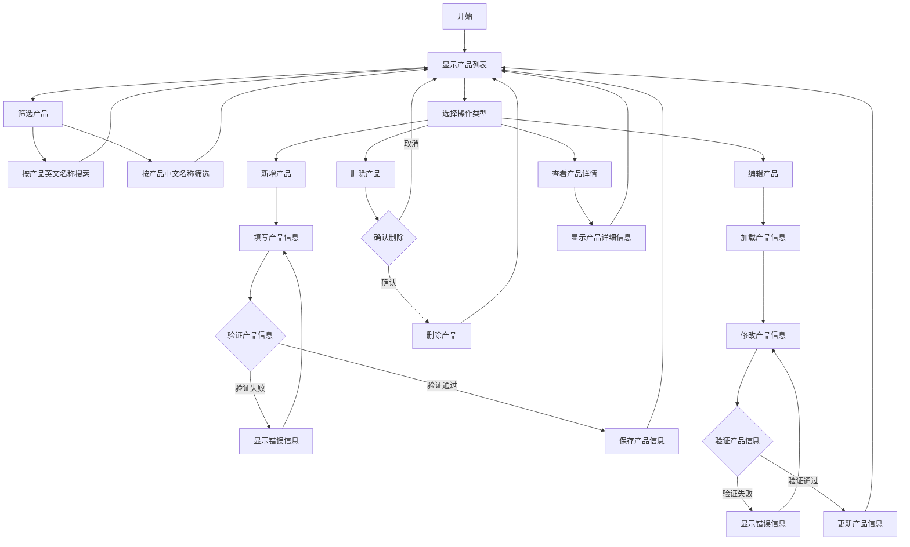
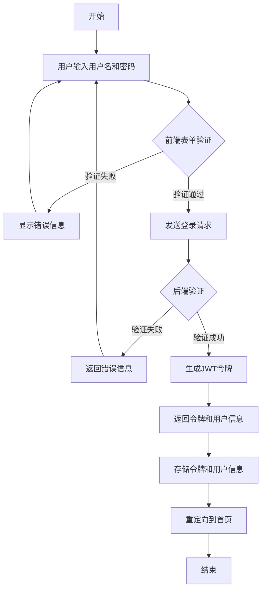
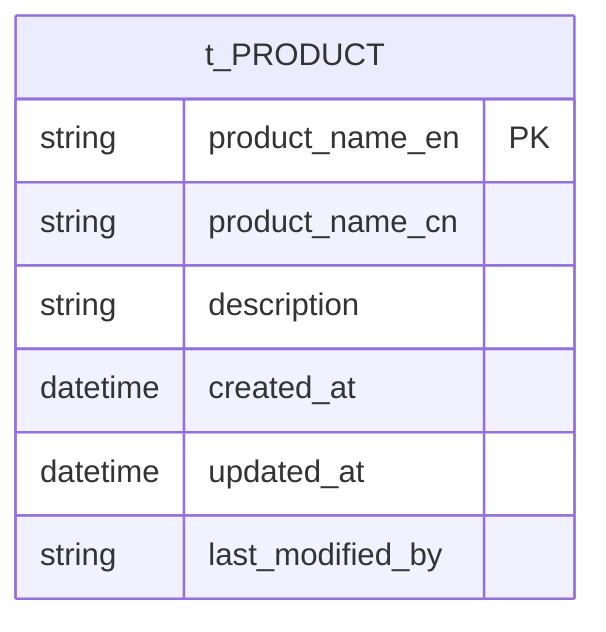
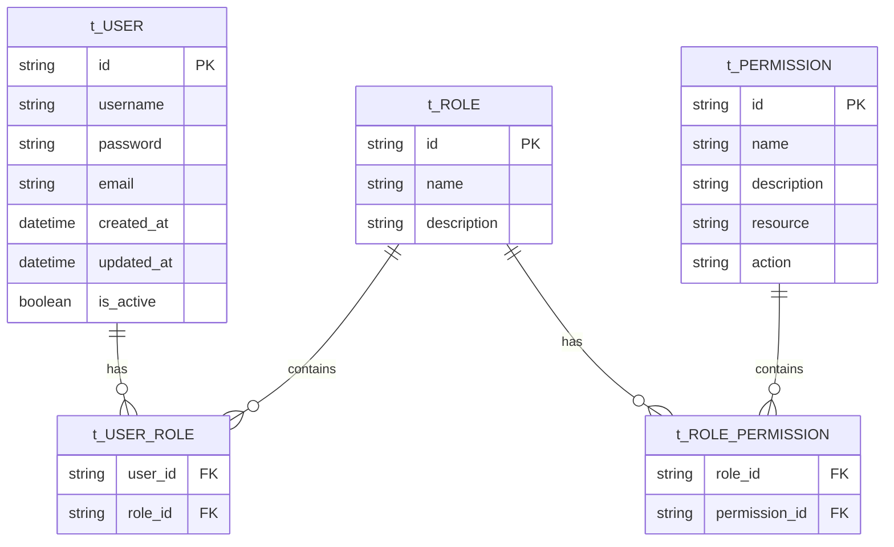

# DSMS (数据结构管理系统)

## 项目结构

- `dsms-web/`: 前端项目 (Vue.js)
- `dsms-backend/`: 后端项目 (Spring Boot)

## 系统设计

### 产品管理功能流程图



### 登录功能流程图



### 产品管理ER图


### 用户认证ER图



## 开发环境要求

### 前端
- yarn
- nuxt

### 后端
- Java JDK 17+
- Maven
- Spring Boot

## 启动说明

### 前端项目
```bash
cd dsms-web
npm install
npm run dev
```

### 后端项目
```bash
cd dsms-backend
./mvnw spring-boot:run